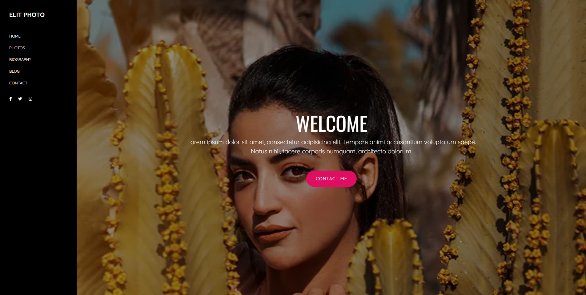

#  Elit Photo — Portfolio de Fotografia

> Projeto desenvolvido como atividade acadêmica na disciplina de **Front‑End** no COTEMIG.

---

##  Sobre o Projeto

Elit Photo é um protótipo de site de portfólio para fotógrafo, com seções que simulam apresentação de fotos, biografia e depoimentos. Todo o layout é visual e demonstrativo — sem funcionalidades de backend, é puramente acadêmico e focado em design e experiência do usuário.

---

##  Funcionalidades Simuladas

- Navegação por seções: **Home**, **Photos**, **Biography**, **Blog**, **Contact**
- Seção de **boas-vindas** com texto de introdução (exemplo em Lorem Ipsum) e imagem principal
- Galeria de imagens (simuladas) para exibição de trabalhos fotográficos
- Depoimento fictício (testimonial) com foto e texto de alguém como "Jean Smith"
- Seção biográfica com imagem e texto sobre o fotógrafo ("Hi I'm Jed") e breve descrição de carreira (“Photographer for 10 years”)

---

##  Tecnologias Utilizadas

- HTML moderno semântica
- CSS para estilos visualmente atraentes e navegação clara
- Layout provavelmente utilizando **grid** ou **flexbox**
- Estrutura responsiva leve, com foco em apresentação visual

---

---

##  Visual do Projeto

A homepage apresenta:

- Um cabeçalho com as seções principais: *Home | Photos | Biography | Blog | Contact*
- Uma introdução visual de boas-vindas (texto Lorem Ipsum)
- Galeria de imagens demonstrativa (placeholders)
- Depoimento fictício com foto ("Jean Smith", texto de exemplo)
- Seção "Biography" com foto e texto do "Jed", incluindo menção de “Photographer for 10 years”

---

##  Objetivos Educacionais

- Aplicar conhecimentos da disciplina de **Front‑End**
- Criar um layout de portfólio elegante e funcional
- Praticar organização visual, navegação intuitiva e apresentação de conteúdo multimídia
- Entender hierarquia de seção e uso de imagens para contar uma história visual

---

##  Visualizar o Projeto

Acesse o site hospedado no GitHub Pages através deste link:

[Elit Photo — Portfolio Online](https://cristalfigueiredoo.github.io/Site-Elit-Photo/)

---

> **Nota:** Este site foi desenvolvido exclusivamente para fins acadêmicos como parte do curso técnico de Front‑End. Não possui backend ou funcionalidades interativas reais — serve como protótipo visual e demonstrativo do seu aprendizado.

